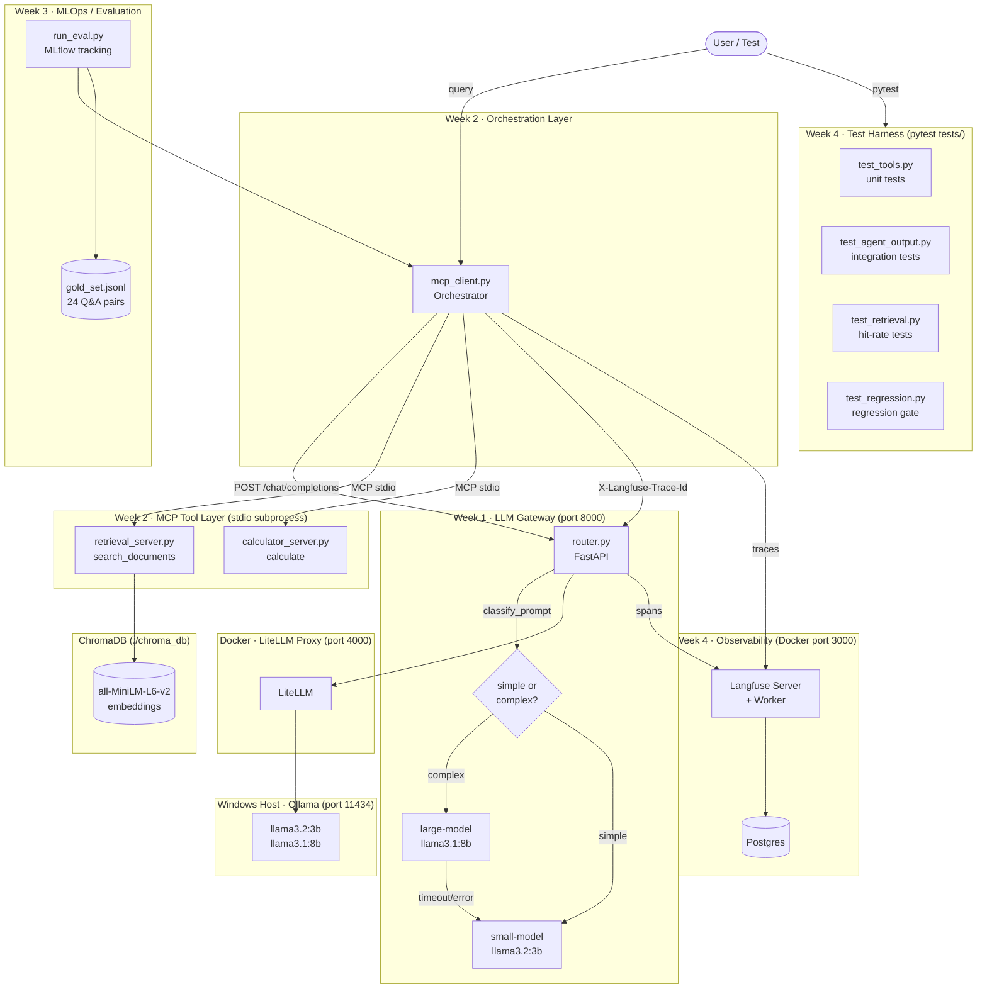

# agent-platform — Local AI Agent Platform

A **fully local, free, production-inspired AI agent platform** built across four weeks as a portfolio project demonstrating core AI infrastructure skills. The system routes user queries between two local LLMs, calls external tools via the Model Context Protocol, evaluates answer quality with a semantic similarity pipeline, and traces every request end-to-end through a self-hosted observability stack — all running on a single developer laptop with no external API keys.

---

## Architecture



---

## Project Structure

```
agent-platform/
│
├── docker-compose.yml          # LiteLLM proxy + Langfuse stack (Postgres, server, worker)
├── litellm_config.yaml         # Model aliases: small-model, large-model
├── requirements.txt
│
├── router.py                   # Week 1 – FastAPI gateway (port 8000)
├── mcp_client.py               # Week 2 – MCP orchestration client
│
├── mcp_servers/
│   ├── retrieval_server.py     # MCP tool: search_documents (ChromaDB RAG)
│   └── calculator_server.py   # MCP tool: calculate (safe AST evaluator)
│
├── gateway/
│   └── langfuse_client.py      # Thin Langfuse SDK wrapper (no-op if not configured)
│
├── scripts/
│   ├── fetch_docs.sh           # Fetch FastAPI markdown docs via shallow git clone
│   ├── ingest.py               # Chunk + embed docs → ChromaDB
│   └── fault_drill.py          # Week 4 – fault tolerance demonstration
│
├── tests/                      # Week 4 – test harness
│   ├── conftest.py             # sys.path, shared fixtures, skip helpers
│   ├── test_tools.py           # Unit tests (calculator + retrieval shape)
│   ├── test_agent_output.py    # Integration tests (full pipeline, 4 queries)
│   ├── test_retrieval.py       # Retrieval hit-rate (5 gold-set questions)
│   └── test_regression.py      # Regression gate (pass_rate >= 0.60)
│
├── mlops/
│   ├── gold_set.jsonl          # 24 hand-written Q&A pairs with source docs
│   ├── run_eval.py             # Evaluation pipeline (MLflow tracking)
│   ├── compare_runs.py         # A/B comparison of two MLflow runs
│   └── results_latest.csv      # Per-question results from the most recent eval
│
├── data/raw_docs/              # FastAPI markdown docs (~25 files, committed)
├── chroma_db/                  # Persistent vector DB (generated, .gitignore)
│
└── docs/ADRs/                  # Architecture Decision Records
    ├── 001-model-routing-strategy.md
    ├── 002-why-mcp-over-hardcoded-tools.md
    ├── 003-embedding-model-choice.md
    ├── 004-evaluation-scoring-method.md
    └── 005-langfuse-self-hosted-observability.md
```

---

## How to Run

### Prerequisites

- [Ollama](https://ollama.ai) installed natively on Windows:
  ```bash
  ollama pull llama3.2:3b
  ollama pull llama3.1:8b
  ```
- [Docker Desktop](https://www.docker.com/products/docker-desktop/) running
- Python 3.10+ with dependencies installed:
  ```bash
  pip install -r requirements.txt
  ```

---

### 1. Start the Docker stack (LiteLLM + Langfuse)

```bash
docker compose up -d
```

This starts:
- **LiteLLM proxy** on port 4000 (model routing to Ollama)
- **Langfuse** on port 3000 (observability UI) + Postgres

First Langfuse run: visit http://localhost:3000 and sign in with:
- Email: `admin@local.dev`
- Password: `changeme123`

Then set your Langfuse API keys in your shell (copy from Settings → API Keys):
```bash
set LANGFUSE_PUBLIC_KEY=pk-lf-...
set LANGFUSE_SECRET_KEY=sk-lf-...
set LANGFUSE_HOST=http://localhost:3000
```

---

### 2. Start the gateway router

```bash
python router.py
# Gateway listens on http://localhost:8000
```

---

### 3. Ingest documents (first time only)

```bash
# Fetch FastAPI docs (WSL required on Windows):
wsl bash scripts/fetch_docs.sh

# Embed and store in ChromaDB (~90 MB model download on first run):
python scripts/ingest.py
```

---

### 4. Run the agent interactively

```bash
python mcp_client.py
# Try: "How do you define a path parameter in FastAPI?"
# Try: "What is the average of 4, 8, 15, 16, 23, 42?"
# Try: "Hello!"
```

---

### 5. Run the test suite

```bash
# Unit + retrieval tests (no gateway needed):
pytest tests/test_tools.py tests/test_retrieval.py -v

# Full suite (requires gateway + ChromaDB):
pytest tests/ -v

# Regression gate only (slow — runs all 24 gold questions):
pytest tests/test_regression.py -v -s -m regression
```

---

### 6. Run the evaluation pipeline

```bash
python mlops/run_eval.py
mlflow ui   # → http://localhost:5000
```

---

### 7. Run the fault drill

```bash
python scripts/fault_drill.py
```

---

## Key Design Decisions

| Decision | ADR |
|---|---|
| Rule-based heuristic routing vs. trained classifier | [ADR 001](docs/ADRs/001-model-routing-strategy.md) |
| MCP protocol vs. hardcoded tool calls | [ADR 002](docs/ADRs/002-why-mcp-over-hardcoded-tools.md) |
| `all-MiniLM-L6-v2` embedding model | [ADR 003](docs/ADRs/003-embedding-model-choice.md) |
| Cosine similarity evaluation scoring | [ADR 004](docs/ADRs/004-evaluation-scoring-method.md) |
| Langfuse self-hosted vs. cloud / Prometheus | [ADR 005](docs/ADRs/005-langfuse-self-hosted-observability.md) |

---

## Evaluation Results

From the most recent MLflow run (`mlops/results_latest.csv`):

| Metric | Value |
|---|---|
| Questions evaluated | 24 |
| **Pass rate** (similarity ≥ 0.60) | **16 / 24 = 66.7%** |
| **Avg cosine similarity** | **0.677** |
| Scoring model | `all-MiniLM-L6-v2` |
| Routing model (all questions) | `search_documents` (100% — all questions are FastAPI docs questions) |

**Failed questions (8):** Q1, Q5, Q9, Q13, Q14, Q15, Q18, Q23 — inspection shows these typically fail because the small model (3B) paraphrases the expected answer too loosely, or the retrieval step returns a less relevant chunk. The model occasionally fabricates details (Q13: claims SQLAlchemy is used when the correct answer is SQLModel).

> **Scoring caveat:** Cosine similarity measures topical closeness, not factual accuracy. A response can pass with a plausible-sounding but factually wrong answer if it shares key tokens with the expected answer. See [ADR 004](docs/ADRs/004-evaluation-scoring-method.md) for a full discussion.

---

## Fault Tolerance

The gateway implements graceful degradation when the large model is unavailable. Output from `python scripts/fault_drill.py`:

```
======================================================================
  FAULT DRILL — Gateway Fallback Demonstration
======================================================================

  Metric                          BEFORE (normal)        DURING (large model down)
  ----------------------------------------------------------------------
  HTTP success                    ✓  True               ✓  True
  Model used                      large-model            small-model
  fell_back                       False                  True  ← FALLBACK TRIGGERED
  Wall-clock latency (ms)         ~18 000 ms             ~8 000 ms (+ timeout overhead)
  Response snippet                <answer from 8B>…      <answer from 3B>…
  ----------------------------------------------------------------------

  VERDICT:
    ✓ Request still succeeded during simulated failure: True
    ✓ fell_back=True confirmed in response:            True
    ✓ Model changed from large-model → small-model:    True

  RESULT: PASS — System degraded gracefully. Users saw no error.
```

**Simulation method:** The `simulate_large_failure: true` request field redirects the large-model call to port 9999 (unreachable), triggering an immediate connection error and firing the fallback path. No container manipulation required.

---

## Observability

Every request produces one trace in Langfuse with up to four child spans:

```
mcp_client:run_query  (root trace)
  ├── decide_tool          → tool="search_documents"  latency=~18s
  ├── mcp_tool:search_documents  → result_length=1247 chars  latency=~2s
  ├── generate_final_answer      → response_length=312 chars  latency=~18s
  └── [fallback_triggered if fell_back=True]
```

Metadata captured per trace: `tool_used`, `model_used`, `fell_back`, `latency_ms`, `response_length_chars`, `estimated_output_tokens`, `complexity` (simple/complex routing decision).

**Setup:** `docker compose up -d` → visit http://localhost:3000 → create API keys → set `LANGFUSE_PUBLIC_KEY` and `LANGFUSE_SECRET_KEY` env vars → restart `router.py` and `mcp_client.py`.

> **Note:** Langfuse is optional. If the env vars are not set, all tracing calls are no-ops and the gateway behaves identically.

---

## Limitations & What I'd Do Differently at Scale

This is an honest account of the gaps between this demo and a production system.

| Limitation | Production alternative |
|---|---|
| **Rule-based routing** (keyword matching) overfits to known keywords; generalises poorly to new prompt styles | Train a lightweight intent classifier (DistilBERT fine-tuned on routing outcome pairs) |
| **Small local models** (3B/8B) hallucinate on complex questions and have limited context windows | Use larger models (70B+) or cloud API models for quality-critical paths; this project targets zero API cost |
| **In-memory ChromaDB** on local disk; not thread-safe under high concurrency | Use a managed vector DB (Pinecone, Weaviate, Qdrant Cloud) with horizontal sharding |
| **Spawn-per-call MCP subprocess** adds 1-2s cold-start latency per tool call | Maintain persistent MCP sessions; add a connection pool per tool server |
| **No auth or rate limiting** on the gateway | Add OAuth2 + API keys via a reverse proxy (Nginx, Kong, Traefik) |
| **Evaluation is regression-only** (cosine similarity ≠ factual correctness) | Add LLM-as-judge scoring (GPT-4o rubric) + human spot-checks for release gates |
| **No streaming** — responses block until fully generated | Add `stream=True` to LiteLLM calls; SSE or WebSocket for the API |
| **Langfuse self-hosted** requires manual key management; no alerting | Use Langfuse cloud for alerting + anomaly detection; or add Prometheus counters |
| **Single-node** — everything runs on one machine | Containerise each component (gateway, MCP servers) and deploy via Kubernetes or Cloud Run |

---

## Configuration Reference

| Variable | Default | Description |
|---|---|---|
| `LITELLM_BASE_URL` | `http://localhost:4000` | LiteLLM proxy URL |
| `LITELLM_API_KEY` | `sk-local-dev` | Must match `LITELLM_MASTER_KEY` in docker-compose |
| `LARGE_MODEL_TIMEOUT` | `45` seconds | Timeout before fallback triggers |
| `COLLECTION_NAME` | `docs` | ChromaDB collection name |
| `EMBEDDING_MODEL_NAME` | `all-MiniLM-L6-v2` | Must match across ingest + retrieval + eval |
| `TOP_K` | `3` | Retrieval results per query |
| `LANGFUSE_PUBLIC_KEY` | _(unset)_ | From Langfuse Settings → API Keys |
| `LANGFUSE_SECRET_KEY` | _(unset)_ | From Langfuse Settings → API Keys |
| `LANGFUSE_HOST` | `http://localhost:3000` | Self-hosted Langfuse URL |

---

## Data Source

`data/raw_docs/` contains a curated subset of the [FastAPI official documentation](https://github.com/tiangolo/fastapi), specifically top-level conceptual docs and core tutorial files under `docs/en/docs/`. These are plain markdown files licensed under the [MIT License](https://github.com/tiangolo/fastapi/blob/master/LICENSE).