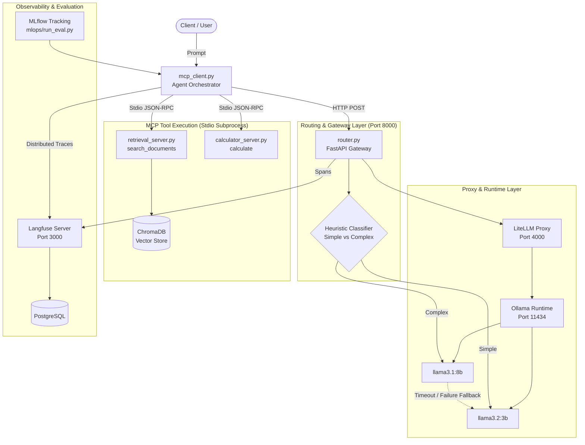

# Agent Platform

A modular, local AI agent orchestration platform featuring heuristic model routing, Model Context Protocol (MCP) tool execution, automated quality evaluation, and distributed tracing.

## Overview

Agent Platform provides an end-to-end architecture for executing AI agent workflows using local open-weight language models. The system routes inbound requests between compact and high-capacity models based on prompt complexity, invokes specialized tool servers via standard Model Context Protocol (MCP) interfaces, and provides automated fallback handling during upstream latency or failure. The platform includes an offline evaluation framework tracked via MLflow and end-to-end request tracing using self-hosted Langfuse.

## Architecture



### Component Breakdown

- **Agent Orchestrator (`mcp_client.py`)**: Manages the agent reasoning loop, tool call dispatching over MCP stdio channels, conversation state, and trace generation.
- **LLM Gateway (`router.py`)**: FastAPI service exposing an OpenAI-compatible endpoint. Evaluates prompt structure and intent against keyword heuristics to select between small and large models, managing timeouts and automated fallback.
- **Model Proxy (`litellm`)**: Containerized proxy standardizing communication between the gateway and local Ollama model instances.
- **MCP Servers (`mcp_servers/`)**: Isolated tools operating over JSON-RPC stdio.
  - `retrieval_server.py`: Semantic search over technical documentation using `sentence-transformers/all-MiniLM-L6-v2` embeddings and ChromaDB.
  - `calculator_server.py`: Safe mathematical evaluation using Python Abstract Syntax Trees (AST).
- **Observability (`gateway/langfuse_client.py`)**: Self-hosted Langfuse v2 instance tracking request latencies, token consumption, routing decisions, and execution metadata.
- **Evaluation Pipeline (`mlops/run_eval.py`)**: Automated benchmarking suite running curated question-answer pairs against ground truth answers, measuring semantic similarity and logging metrics to MLflow.

## Prerequisites

- **Operating System**: Linux, macOS, or Windows (WSL2 recommended for shell scripting)
- **Python**: 3.11+
- **Docker**: Docker Engine and Docker Compose v2+
- **Ollama**: Local instance running on port 11434 with required models pulled:
  ```bash
  ollama pull llama3.2:3b
  ollama pull llama3.1:8b
  ```

## Installation

1. **Clone the repository**:
   ```bash
   git clone https://github.com/Y0gnut/agent-platform.git
   cd agent-platform
   ```

2. **Create and activate a virtual environment**:
   ```bash
   python -m venv .venv
   # Windows PowerShell:
   .venv\Scripts\Activate.ps1
   # Linux / macOS:
   source .venv/bin/activate
   ```

3. **Install Python dependencies**:
   ```bash
   pip install -r requirements.txt
   ```

4. **Populate vector store**:
   ```bash
   python scripts/ingest.py
   ```

## Configuration

Copy the sample environment template and adjust configuration values as needed:

```bash
cp .env.example .env
```

### Environment Variables

| Variable | Default | Description |
|---|---|---|
| `LITELLM_BASE_URL` | `http://localhost:4000` | Address of the LiteLLM proxy container |
| `LITELLM_API_KEY` | `sk-local-dev` | Shared authentication secret between gateway and LiteLLM |
| `LARGE_MODEL_TIMEOUT` | `45` | Execution timeout in seconds for high-capacity model before triggering fallback |
| `LANGFUSE_HOST` | `http://localhost:3000` | Address of the self-hosted Langfuse server |
| `LANGFUSE_PUBLIC_KEY` | *(optional)* | Public API key generated via the Langfuse web interface |
| `LANGFUSE_SECRET_KEY` | *(optional)* | Secret API key generated via the Langfuse web interface |
| `POSTGRES_USER` | `langfuse` | PostgreSQL database user for Langfuse storage |
| `POSTGRES_PASSWORD` | `langfuse_secret` | PostgreSQL database password |
| `POSTGRES_DB` | `langfuse` | PostgreSQL database name |

## Usage

### 1. Launch Infrastructure Services

Start the LiteLLM proxy, PostgreSQL database, and Langfuse observability server:

```bash
docker compose up -d
```

Verify service health:
- LiteLLM: `http://localhost:4000/health`
- Langfuse UI: `http://localhost:3000`

### 2. Start the Gateway Router

Launch the FastAPI model router:

```bash
python router.py
```

The gateway listens on `http://localhost:8000`. Test gateway health:

```bash
python scripts/verify_gateway.py
```

### 3. Run the Agent Orchestrator

Run interactive agent queries from the command line:

```bash
python mcp_client.py
```

Example queries:
- Retrieval: `"How do you define path parameters in FastAPI?"`
- Calculation: `"Calculate (14 * 28) / 4"`
- General dialogue: `"Explain the purpose of health check endpoints."`

### 4. Execute the Evaluation Pipeline

Benchmark agent outputs against the curated dataset (`mlops/gold_set.jsonl`):

```bash
python mlops/run_eval.py
```

Inspect metric trends, pass rates, and latency distributions via the MLflow dashboard:

```bash
mlflow ui --port 5000
```

### 5. Run the Fault Tolerance Drill

Verify gateway resilience and fallback behavior under upstream failure:

```bash
python scripts/fault_drill.py
```

## Project Structure

```
agent-platform/
|-- docker-compose.yml          # LiteLLM proxy and Langfuse PostgreSQL stack
|-- litellm_config.yaml         # LiteLLM model routing definitions
|-- requirements.txt            # Project dependencies
|-- router.py                   # FastAPI routing gateway with fallback logic
|-- mcp_client.py               # CLI agent orchestrator and MCP client
|-- gateway/
|   `-- langfuse_client.py      # Langfuse observability client and no-op fallback
|-- mcp_servers/
|   |-- calculator_server.py    # Safe AST calculator tool server
|   `-- retrieval_server.py     # ChromaDB semantic search tool server
|-- mlops/
|   |-- gold_set.jsonl          # Evaluation benchmark dataset
|   |-- run_eval.py             # Automated MLflow evaluation runner
|   `-- compare_runs.py         # Comparative run analysis utility
|-- scripts/
|   |-- fetch_docs.sh           # Documentation retrieval script
|   |-- ingest.py               # Document ingestion and embedding script
|   |-- fault_drill.py          # Automated gateway fallback verification
|   `-- verify_gateway.py       # Gateway connectivity and routing check
|-- tests/
|   |-- conftest.py             # Shared fixtures and path resolution
|   |-- test_tools.py           # Unit tests for tool servers
|   |-- test_retrieval.py       # Hit-rate verification for retrieval server
|   |-- test_agent_output.py    # End-to-end integration tests
|   `-- test_regression.py      # Regression test harness
|-- docs/
|   `-- ADRs/                   # Architecture Decision Records
|       |-- 001-model-routing-strategy.md
|       |-- 002-why-mcp-over-hardcoded-tools.md
|       |-- 003-embedding-model-choice.md
|       |-- 004-evaluation-scoring-method.md
|       `-- 005-langfuse-self-hosted-observability.md
|-- LICENSE                     # Project license
`-- CONTRIBUTING.md             # Contribution guidelines
```

## Testing

The project uses `pytest` for unit, integration, and regression testing.

Run isolated unit and retrieval tests (requires no external containers):

```bash
pytest tests/test_tools.py tests/test_retrieval.py -v
```

Run the complete test suite (requires active gateway and ChromaDB index):

```bash
pytest tests/ -v
```

Run the regression evaluation gate:

```bash
pytest tests/test_regression.py -v -s -m regression
```

## License

This project is licensed under the MIT License. See [LICENSE](LICENSE) for details.